# Quick Start
  
## First time login

Open  http://localhost:6688/poli/login in chrome.

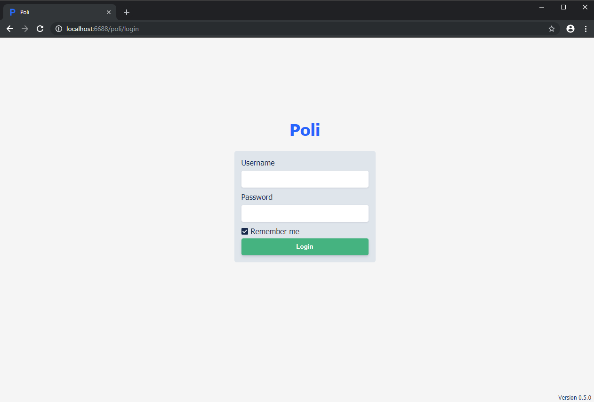

Use the default login credentials.

* username: admin
* password: adminadmin

Enter a new password and login again.

## Create a datasource

Enter the data source connection information.

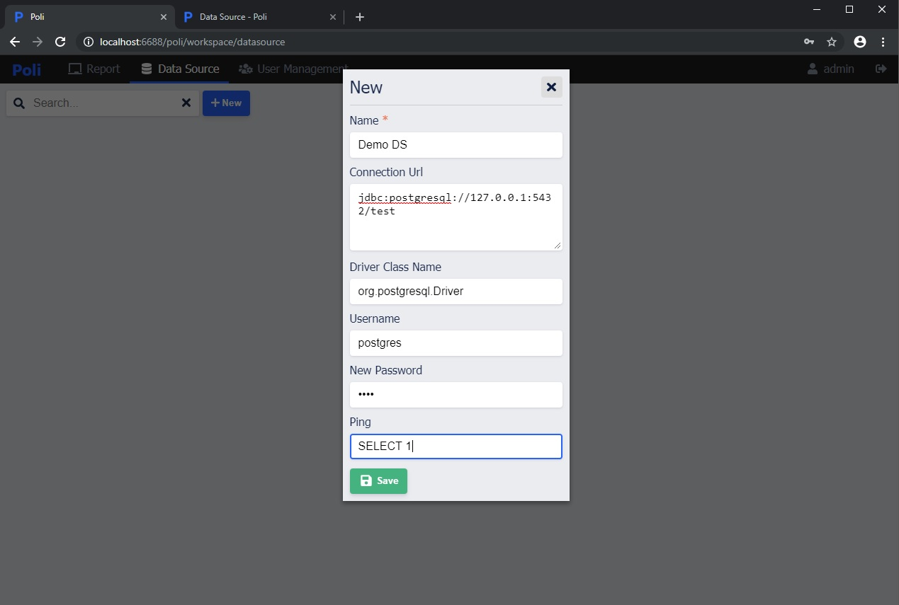

Click ping button to test the connection.

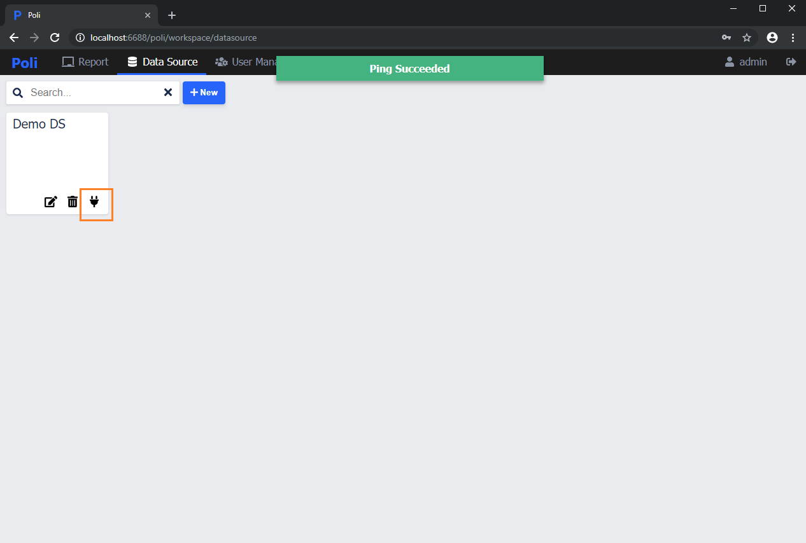

## Create a report

Click report tab and be ready to create the first report!

Enter the report name.

Click save button. A new report is created!

create table transaction (
	create_date TIMESTAMP,
	category varchar(100),
	amount NUMERIC(10, 2)
)

## Create a static component

Let's create a text box here. Click the edit button to enter report edit mode.

Click new component button. Select static and text. Enter the value under config tab.

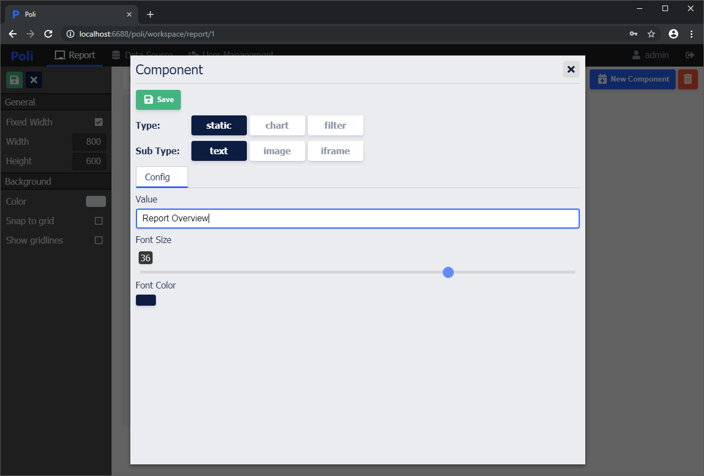

Click save button. A new text box is created!

## Create a chart component

Let's create a pie chart here. Click new component button. Select chart and pie.

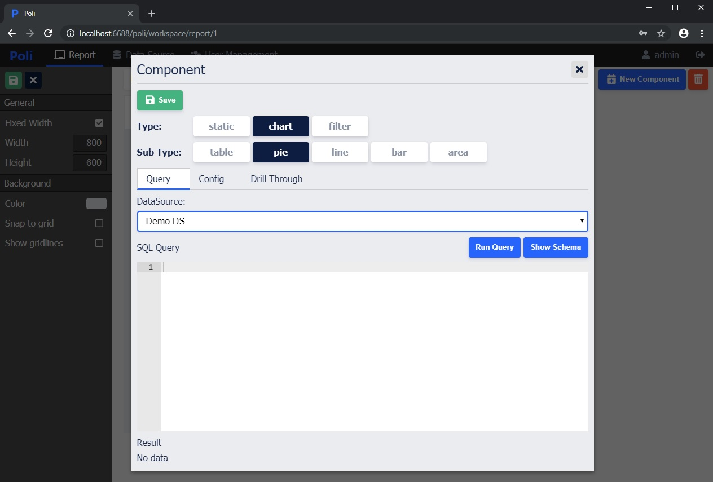

Choose a data source and enter a query.

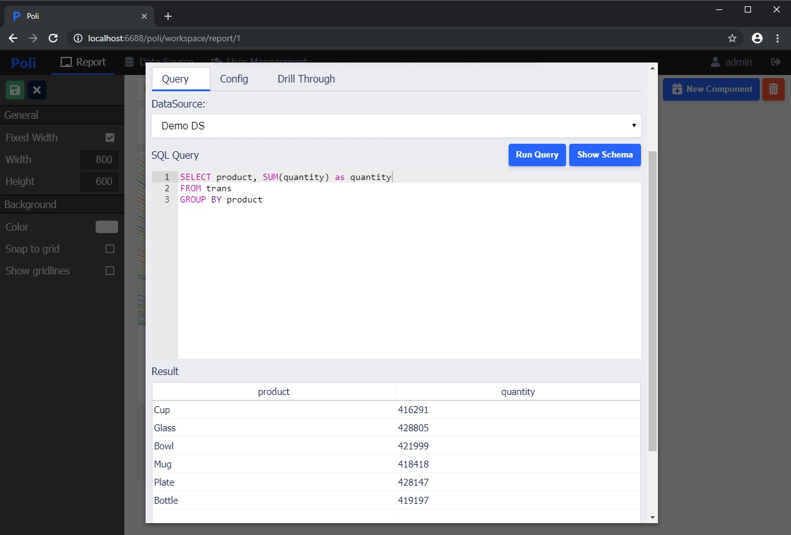

Go to config tab and select the key vand value for pie chart.

Click save button. A new pie chart is created!

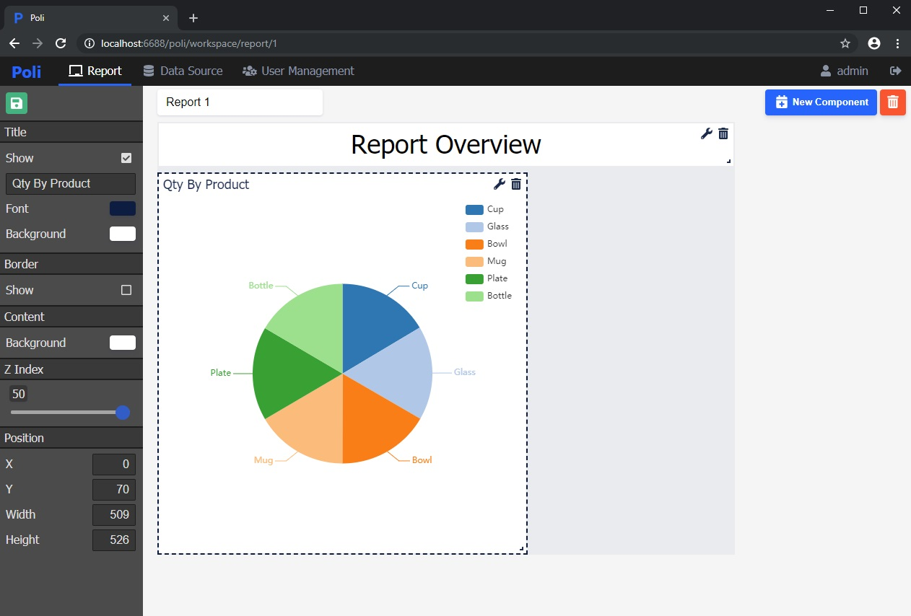

## Create a filter component

Let's create a slicer here. Click new component button. Select filter and slicer. Choose a data source and enter a query.

Go to config tab and assign a value to the query parameter.

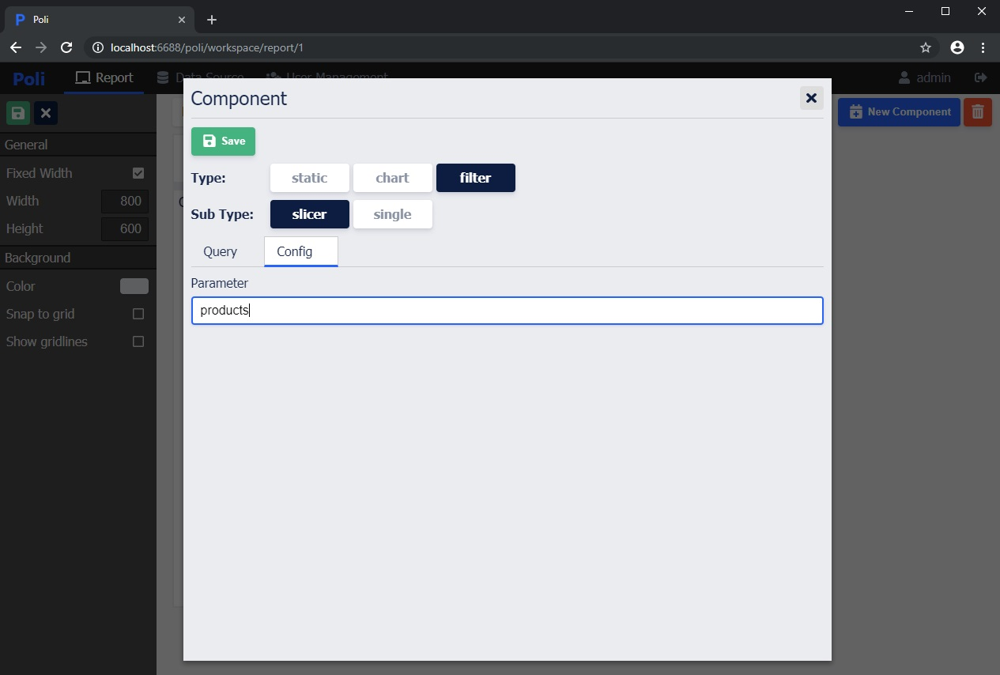

Click save button. A new sclier is created!

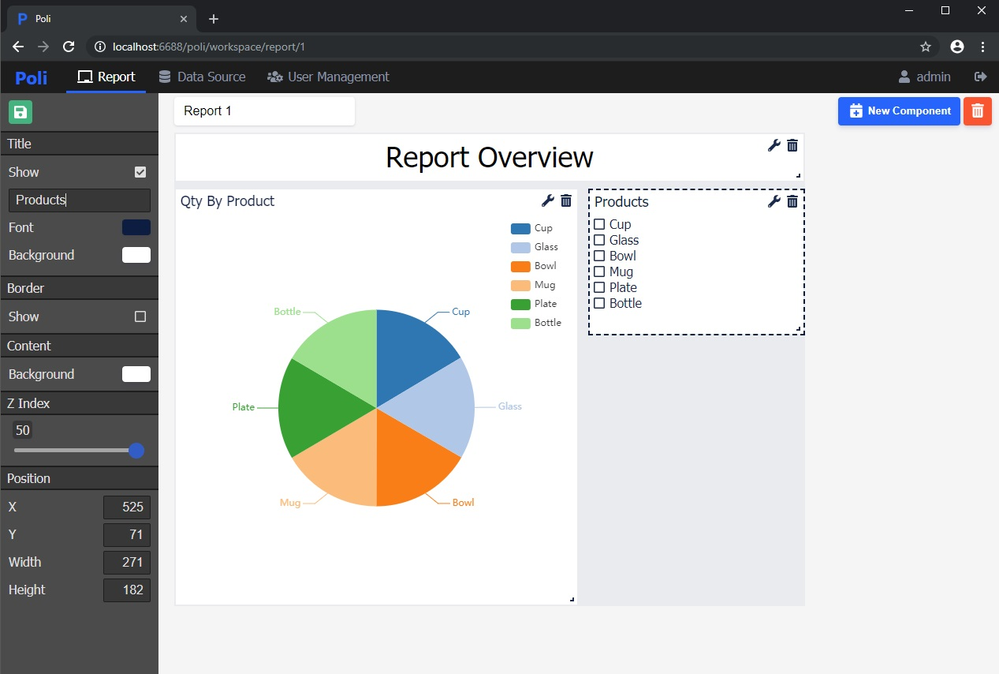

Now it is time to link the slicer and pie chart together. Edit the pie chart query here to include the query parameter.

Save the report. Select the check box in slicer and click apply filters button. The data in pie chart is being filtered! 

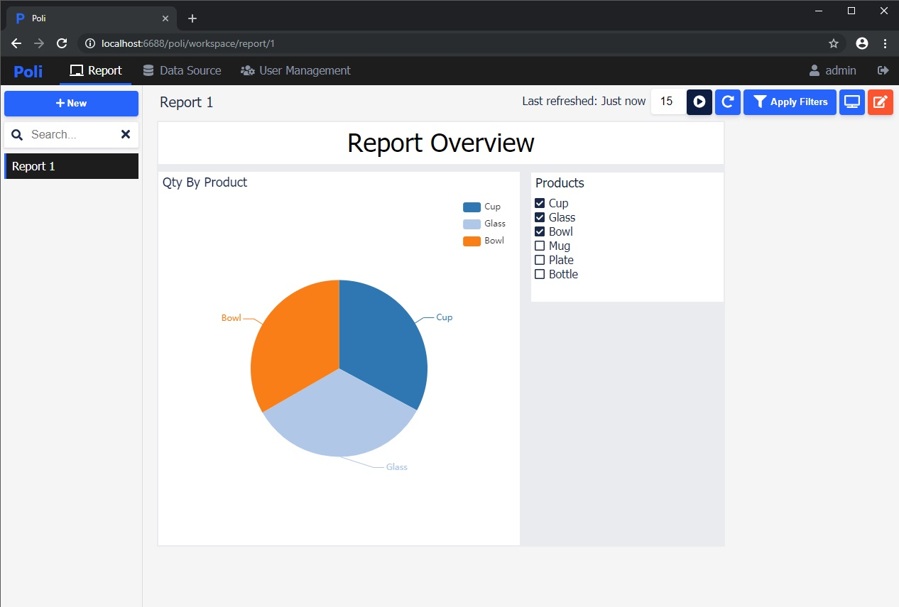

## Create a group

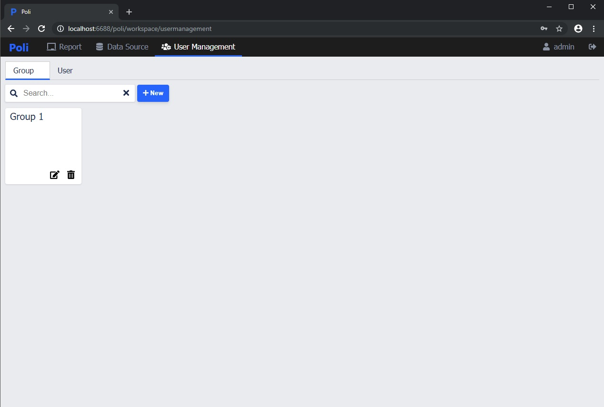

## Create a user

## View the report

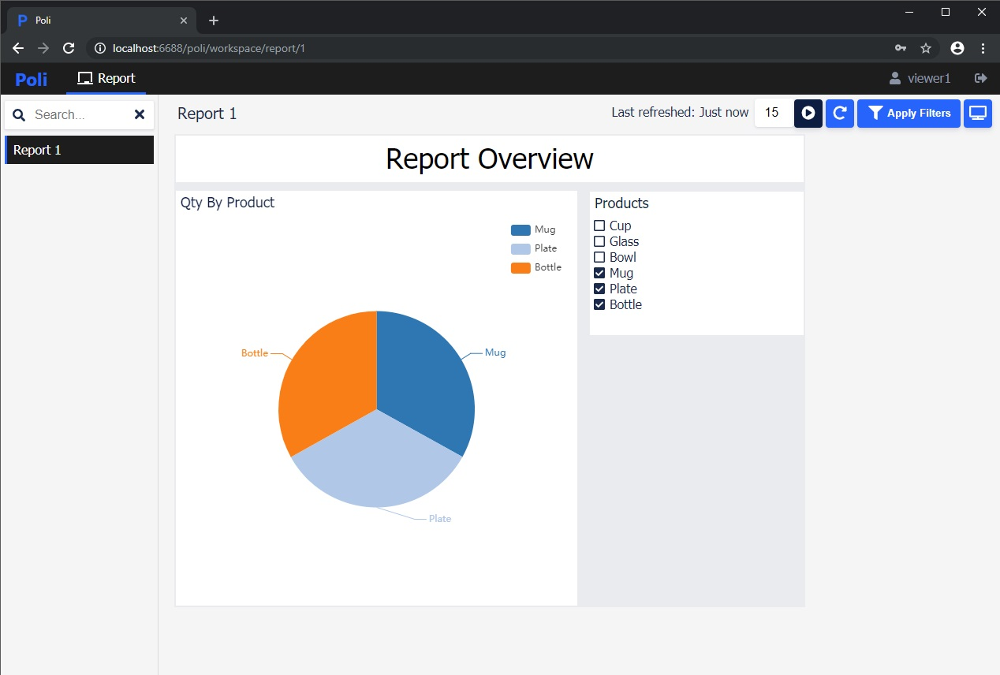