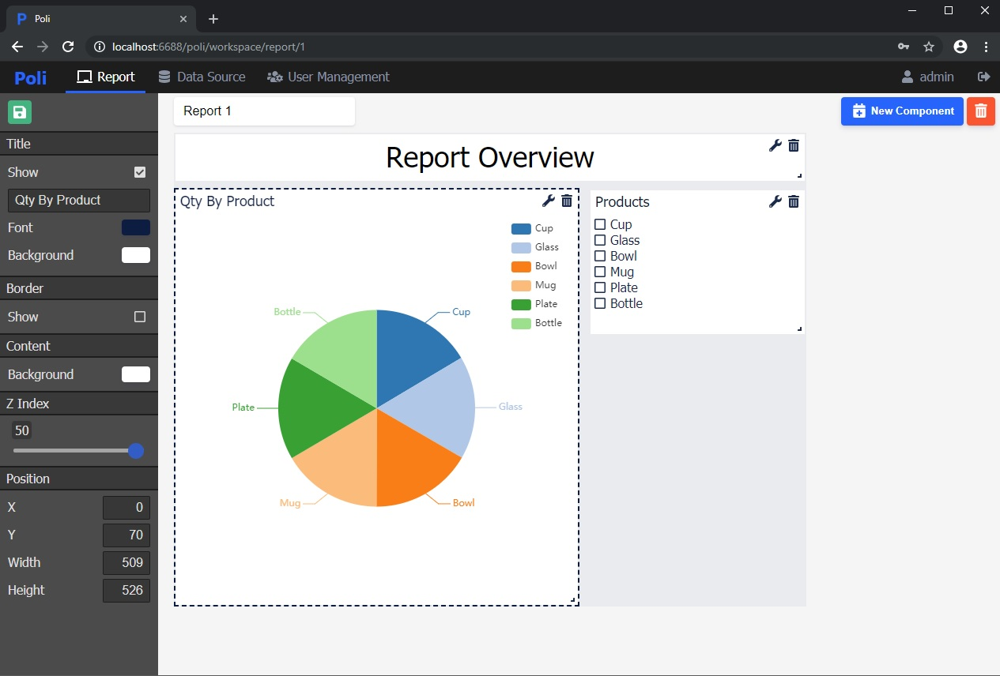
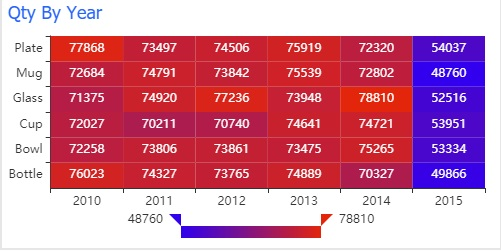
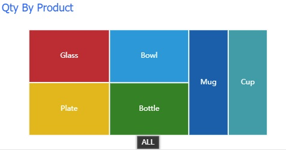
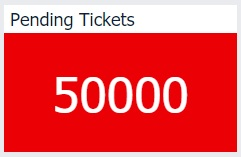
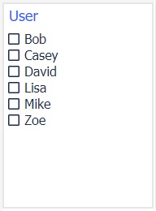
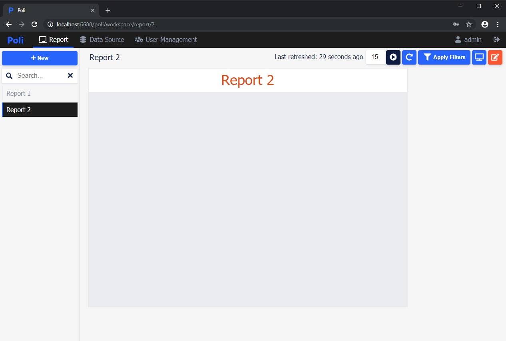
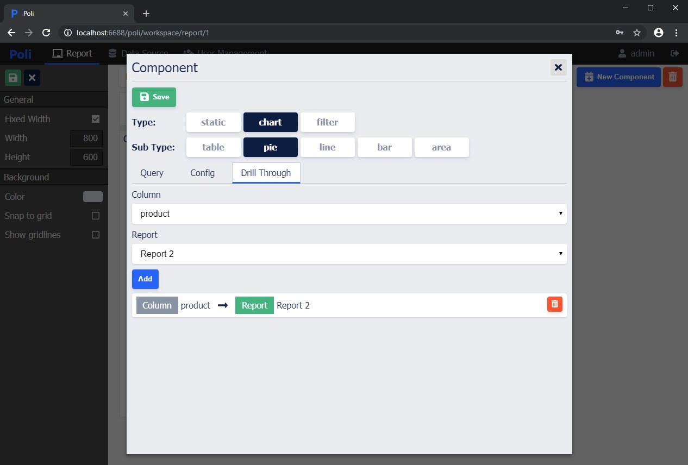
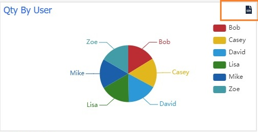
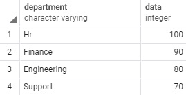

# Report Component

## Style customization

* Title
* Position (x, y, width, height, z Index)

  Components can be repositioned and resized on the report. If you'd like to stack/overlap components, z index field can be used to control the stacking order.

  > The selected component can be moved by using arrow key in order to provide more precise control.

* Border
* Content background color 

> After modifying the style, don't forget to click the save button to save the changes.



## Types

Poli supports three types of components.

### Static
  * Text
  * Image
  * Iframe
  * Html

### Chart

#### Table

#### Pie
    
  > The query is required to return at least two columns.

#### Bar
#### Line
#### Area

  > Bar/Line/Area charts support multi-series data.
  
#### Heatmap

Data:
- X-Axis
- Y-Axis 
- Value (number)
- Min Value Color
- Max Value Color

> The query is required to return at least three columns.



#### Treemap

Data:
- Key (text)
- Value (number)
- Color Platte

> The query is required to return at least two columns.



#### Funnel

Config:
- Key (text)
- Value (number)
- Color Platte


#### Card

Card displays a single value. 

Config:
- Font Size
- Font Color

> The query is required to return one column with one value only.




### Filter

#### Slicer

Slicer provides a list of values to select. 



It requires the query to return one column only.

```sql
SELECT user_id 
FROM trans 
GROUP BY user_id 
ORDER BY user_id;
```
  
#### Single value

#### Date picker

The default format is yyyy-MM-dd. For example, 2018-08-10. 


Example to use the query parameters in a query.

```sql
SELECT * FROM TRANSACTIONS
WHERE 1 = 1
{{ AND created_date > :start_date }}
{{ AND created_date <= :end_date }}
ORDER BY created_date ASC;
```

## Dynamic SQL query with parameters

To use this feature, you would need to create at least one filter and one chart component. Here is how it works.

1. Create a filter and define a query parameter. The query parameter serves as a placeholder for a real value in the query string. 
2. Create a chart and use the query parameter from the fitler in the SQL query.
3. Enter/Select the value in the filter and click apply filter button to see the chart data change accordingly.

For example:

Create a Slicer filter and define username as query parameter.
```sql
-- Slicer
SELECT username FROM user GROUP BY username;
```

Create a Table chart and use the :username in the IN clause.
```sql
-- Table
SELECT * FROM user WHERE 1 = 1 {{ AND username IN (:username) }}
```

More dynamic query examples:

```sql
-- Query parameter from Slicer
SELECT * FROM user WHERE 1 = 1 {{ AND name IN (:name) }}

-- Query parameter from Single value
SELECT * FROM user WHERE 1 = 1 {{ AND name = :name }}

-- More
SELECT * 
FROM user 
WHERE 1 = 1 
{{ AND department IN (:department) }}
{{ AND role = :role }}
{{ AND created <= :created }}
ORDER BY last_login DESC
```

Nested parameters are not supported. For example:

```sql
-- Invalid
SELECT * 
FROM user 
WHERE 1 = 1 
{{ 
    AND department IN (:department) 
    {{ AND role = :role }}
}}
```

## Drill through

Drill through is used to navigate from one component in a Report to another Report. To use it in Poli, you need to have at least two reports.



1. Create a pie chart in Report 1. Go to Drill Through tab. Choose the source column and destination report.



2. Click the Cup piece on the pie chart.

> If this component has drill through defined, there will be a --> icon on the title bar.


3. Report 2 is being displayed and product=Cup is passed along to Report 2. If there are any chart components on Report 2 that use :product query parameter in the query will become reactive.


## Export CSV

Click export button at the top right corner of the chart to export chart data as CSV file.



> The CSV file exported is in UTF-8 and it might take extra steps in Excel for it to be recognized.

## Row Level Security

To limit the user access to all records in the table, the records returned by the query can be controlled at row level based on the user attributes defined at per user level.

To use this feature, you would need to go to User page to add some user attributes and then use them in the dynamic query.

For example,

Assume that we have a table: department_data. The goal here is to have user1 who is from Engineering department to only see the records for Engineering department. 



1. Create a new user: user1. Define a user attribute on the User page.


2. Create a table chart using

```sql
SELECT *
FROM department_data 
WHERE 1 = 1 
{{ AND department = :$user_attr[department] }}
```

> The syntax for using user attribute parameters in dynamic query is: :$user_attr[@YOUR_USER_ATTRUBTE_KEY]

3. Login in as user1 and check the report. Only one record is displayed.


